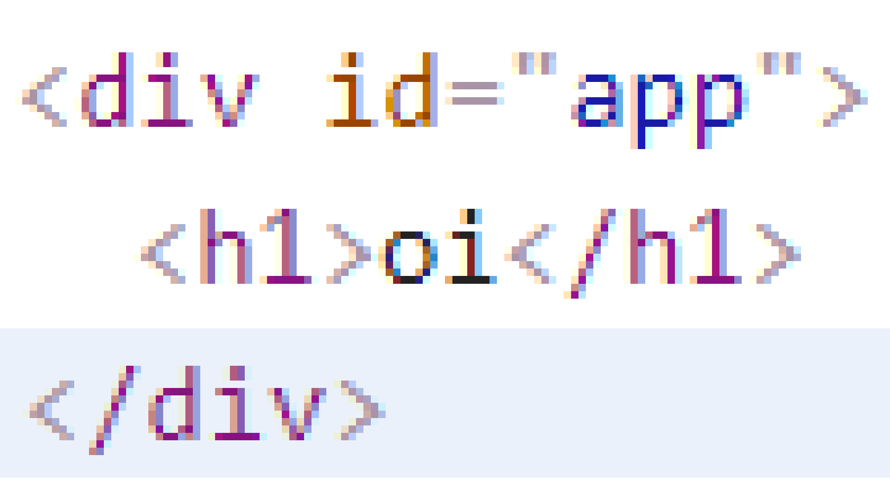

## Conteúdo
- [O que é o React?](##o-que-é-o-react?)
- [Por que ele foi criado?](##por-que-ele-foi-criado?)
- [Por que eu deveria o usar?](##por-que-eu-deveria-o-usar)
- [Como o usar?](##como-o-usar?)
- [Sua primeira aplicação React](##sua-primeira-aplicação-react)
- [Ok mas como isso funciona?](##ok-mas-como-isso-funciona?)
- [O real motivo de usarmos o React para interfaces complexas](##o-real-motivo-de-usarmos-o-react-para-interfaces-complexas)
- [Finalizando](##finalizando)

## O que é o React?
O React é uma biblioteca de construção de interfaces para a Web de maneira declarativa usando componentes com Javascript criada pelo Facebook. Resumindo: é uma biblioteca JS que lhe ajuda a criar interfaces complexas.

Para uma visão mais técnica do React, recomendo ler a documentação oficial dela: https://reactjs.org/tutorial/tutorial.html#overview

## Por que ele foi criado?
Basicamente para facilitar o trabalho dos desenvolvedores do Facebook. Conforme o Facebook ia ganhando mais e mais funcionalidades e sua interface fosse ficando cada mais complexa de fazer a manutenção (e mais lenta), uma solução era necessária e essa solução foi criada por um de seus desenvolvedores, o React.

## Por que eu deveria o usar?
Quando se está fazendo interfaces muito complexas para aplicações Web (leia-se grandes e/ou com muita interação) o React pode te ajudar muito. Graças ao uso de componentes, criação de interfaces de maneira declarativa e implementação de conceitos de programação funcional (não se assuste com esse último ponto, é bem legal), ele lhe permite facilmente implementar interfaces que seriam um verdadeiro pesadelo com apenas HTML e JS puros e infinitamente mais fácil de se manter. 

## Como o usar?
Para usar o React em uma página Web tudo o que  se precisa fazer é importar dois scripts Javascript dentro de uma página Web, sendo eles o [React](https://github.com/facebook/react) e o [ReactDOM](https://github.com/facebook/react/tree/master/packages/react-dom). É claro, como tudo em programação, existem milhares de maneiras de se fazer isso, mas para seguir esse tutorial eu recomendo uma das duas abordagens:

Usar um codepen com o React já importado: https://codepen.io/rpichioli/pen/rrdzQB

OU

Crie uma página Web e instale o React de maneira mais "rudimentar" (Recomendado):
1. Crie um arquivo `html` simples:
``` html
<!DOCTYPE HTML>
<html>
    <head>
    <meta charset="UTF-8">
    <title>Aprendendo React</title>
    </head>
    <body>

    </body>
</html>
```

2. Importe os scripts do `React` e `ReactDOM` usando um cdn:
``` html
<!-- Não precisa alterar o resto -->
<body>
    <script src="https://cdnjs.cloudflare.com/ajax/libs/react/16.12.0/umd/react.production.min.js"></script>
    <script src="https://cdnjs.cloudflare.com/ajax/libs/react-dom/16.11.0/umd/react-dom.production.min.js"></script>
</body>
```

3. Crie um arquivo javascript que será onde escreveremos nossa aplicação _React_, dê a ela o nome `app.js` (ou algum outro se quiser, mas eu usarei esse pro resto dos tutoriais)
``` html
<script src="app.js"></script>
```

4. Pronto, agora você pode começar a criar uma aplicação _React_!

## Sua primeira aplicação React
Para criar uma aplicação _React_ não é tão difícil assim, precisamos de apenas duas coisas:

1. Um elemento HTML que será o "container" da nossa aplicação (com container quero dizer aonde nossa aplicação estará dentro da página Web)
``` html
<body>
  <div id="app"></div> <!-- ele deve estar vazio mesmo -->
</body>
```

2. Dentro do `app.js` Falar pro `ReactDOM` criar a nossa aplicação _React_ no nosso "container" criado no passo anterior 
``` javascript
ReactDOM.render(
    React.createElement("h1", null, "oi"), // Um elemento React
    document.querySelector("#app") // Aonde está o container da aplicação React
)
```

3. E pronto, dentro do seu arquivo `app.js` você já pode começar a criar uma aplicação _React_!

## Ok mas como isso funciona?
Basicamente, quando se usa a função `React.createElement()`, você está apenas criando um elemento React, que é um objeto javascript descrevendo um elemento HTML, que então depois dizemos pra ser "convertido" em um elemento HTML de verdade e colocado dentro da nossa página Web usando a função `ReactDOM.render()`.

Se você for acessar as ferramentas de desenvolvedor do seu navegador e ver o que resultará do React, você verá puro e simples HTML:


## O real motivo de usarmos o React para interfaces complexas
Agora você pode estar se perguntado o porque de usarmos o React então e não apenas HTML, é bem simples, poder. Graças a facilidade de se criar um elemento HTML com React, nós podemos muito mais facilmente criar interfaces dinâmicas, mudar o conteúdo dentro do conforme o usuário interage com nossa página e ter uma interface com muita interação mais rápida.

Para entender melhor, vamos ver como criar o mesmo elemento de cima com Javascript puro:
``` javascript
let elemento = document.createElement("h1")
elemento.innerHTML = "oi"
let container = document.querySelector("#app")
container.appendChild(elemento)
```

Esse código, parece ser simples, mas ele tem alguns problemas, primeiramente, é bem mais difícil colocar um elemento dentro de outro do que no React(como fazer isso veremos um pouco a frente) e ele é lento. Toda vez que você cria um elemento e o adiciona usando a função `appendChild()` do HTML, a página inteira basicamente precisa ser recriada, o que é lento. Isso normalmente não é tão ruim, mas quando se está criando uma interface muito complexa, essa lentidão de modificar a interface acumula, vide Facebook:


O Facebook têm inúmeras partes que constantemente mudam, por exemplo: 
- Timeline
- Chat
- Notificações
- Stories

E como a interface dele é bem grande, recriar tudo, toda vez que alguma coisinha muda torna tudo muito lento.

Para resolver esse problema, o React tem algo chamado de _Shadow DOM_ que o ajuda com isso. Basicamente, ao invés de o React modificar o DOM da página Web diretamente toda vez que quiser fazer uma alteração, fazendo com que tudo seja recriado, ele faz essa alteração em um "DOM de mentira", o _Shadow DOM_, que detecta as únicas coisas que realmente foram mudadas e então faz essas alterações de maneira muito mais rápida que o navegador consegue normalmente.

## Finalizando
E agora você já deve ter entendi o que o React é. Na próxima parte, iremos aprenderemos detalhes e como criar elementos React.