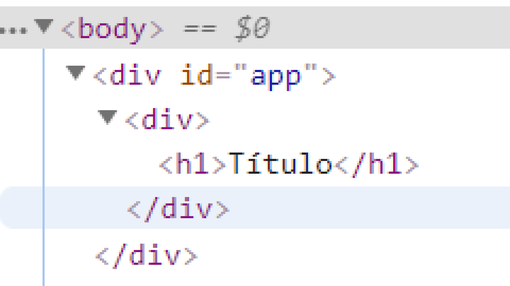

## Conteúdo
- [Elementos React](##elementos-react)
- [Como criar elementos dentro de outros elementos](##como-criar-elementos-dentro-de-outros-elementos)
- [className](##className)
- [Finalizando](##finalizando)

## Elementos React
Para se criar interfaces no React, basicamente, ao invés de usar o HTML e o javascript (para criar elementos HTML dinâmicamente), você cria tudo com o próprio React.

Para se criar um elemento React, você usa a função `React.createElement()`, que tem 3 parâmetros:
- o 1º parâmetro é o tipo de elemento, se quer um `h1`, coloque no primeiro parâmetro em uma string o elemento: `React.createElement("h1", ...)`, todos os elementos que se pode criar com HTML você pode criar com React, por exemplo: `h2`, `h6`, `div`, `img`, `video`, `canvas`.

- O 2º parâmetro são as propriedades, se quer que o seu elemento tenha por exemplo a propriedade id com o valor mandioca por exemplo você o adiciona da seguinte forma: `React.createElement("h1", { id: "mandioca" }, ...)`. Esse parâmetro pode ser `null` se você quiser que o seu elemento não tenha propriedades.

- O 3º e último parâmetro é o conteúdo, por exemplo, se você quiser ter o texto "Mandioca" dentro de seu `h1`, preencha a função da seguinte forma: `React.createElement("h1", { id: "mandioca" }, "Mandioca")`. Esse parâmetro pode ser `null` se você quiser que o seu elemento não tenha um conteúdo dentro dele.

Exemplos de diferentes elementos React:
- `react.createElement(h1, null, "Minha página legal")`
- `React.createElement("img", { src: "http://pudim.com.br/pudim.jpg" }, null)`
- `React.createElement("video", { controls: "controls", width: "320", src: "https://kutt.it/7nbVKz" }, null)`

## Como criar elementos dentro de outros elementos
É claro, no React você pode ter um elemento dentro de outro elemento, por exemplo, em HTML, para se ter um `h1` dentro de um `div` basta:
``` html
<div>
  <h1>Título</h1>
</div>
```

Já no React, para se fazer isso é, você criar um elemento React dentro de uma variável e dizer que o conteúdo de outro elemento é o sua variável. Mais fácil entender como código:
``` javascript
let titulo = React.createElement("h1", null, "Título");

ReactDOM.render(
  React.createElement("div", null, titulo),
  document.querySelector("#app")
)
```

O resultado final no HTML será o mesmo que se você fizesse com HTML originalmente.


## className
Algo muito importante em relação ao _React_: devido a keyword `class` ser usada no Javascript ES2015+, você não pode a usar dentro do React, use no lugar o `className`, por exemplo: `React.createElement("h1", { className: "mandioca" }, "mandioca")` 

## Finalizando
E isso é o básico do React, é claro, o que vimos até agora é apenas a ponta do Iceberg, nas próximas partes veremos mais partes do React que nos ajudarão a criar interfaces incríveis!